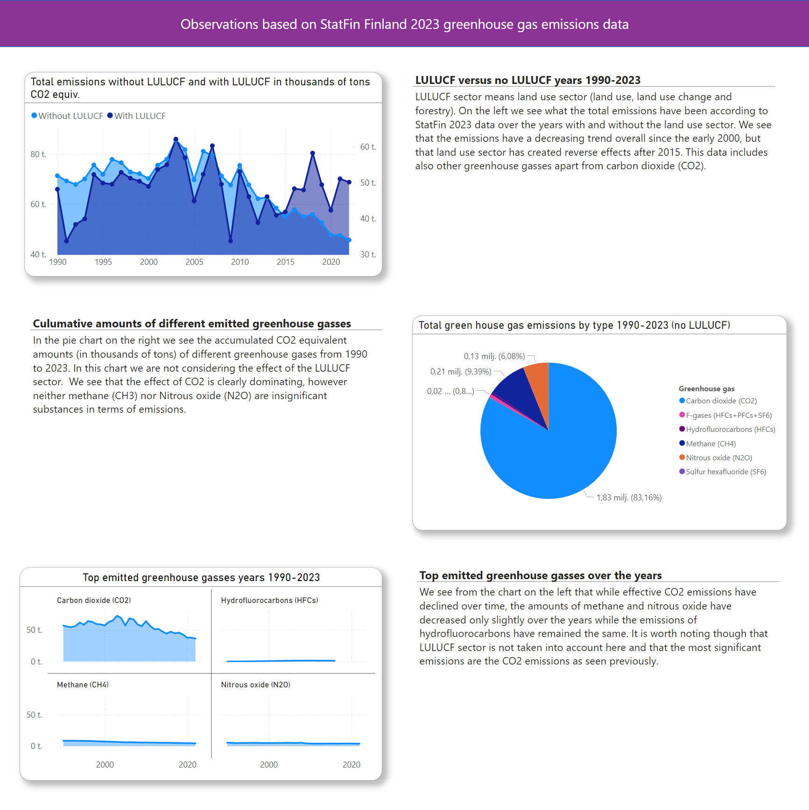

# FinlandEmissions2023

FinlandEmissions2023 is a small project, in which I investigate through visualizations various aspects of StatFin Finland 2023 greenhouse emission data, which covers years from 1990 to 2023. It includes greenhouse gas emissions from various sectors in a detailed way such as land use, energy and transport. Apart from CO2 emissions, it includes emissions in other greenhouse gasses, such as methane. One can browser the data from https://stat.fi/tilasto/khki. I however wrote a simple python code to retrieve a chunk of the data from StatFI public API for further processing in PowerBI to create the visualizations.

This git project includes PowserPI project files and python code used to acchieve a result shown in the screenshot in Figure 1.

<figure>
  
  <figcaption>Figure 1. Screenshot of a PowerBI report</figcaption>
</figure>
 
 

# Status

The work so far has involved the following tasks

- Finding out how to retrieve the data
- Examining what is in the data
- Transforming the data to suit the PowerBI visualization (cleaning rows with missing data)
- Writing PowerBI measures using filtering the data for meaningful visualizations
- Implementing visualizations, which tell some aspects of the data that I find interesting
- Stylizing the composed report

# Todo

I find the topic quite interesting and I intend to dig further into the data and try to find more things it has to tell.
