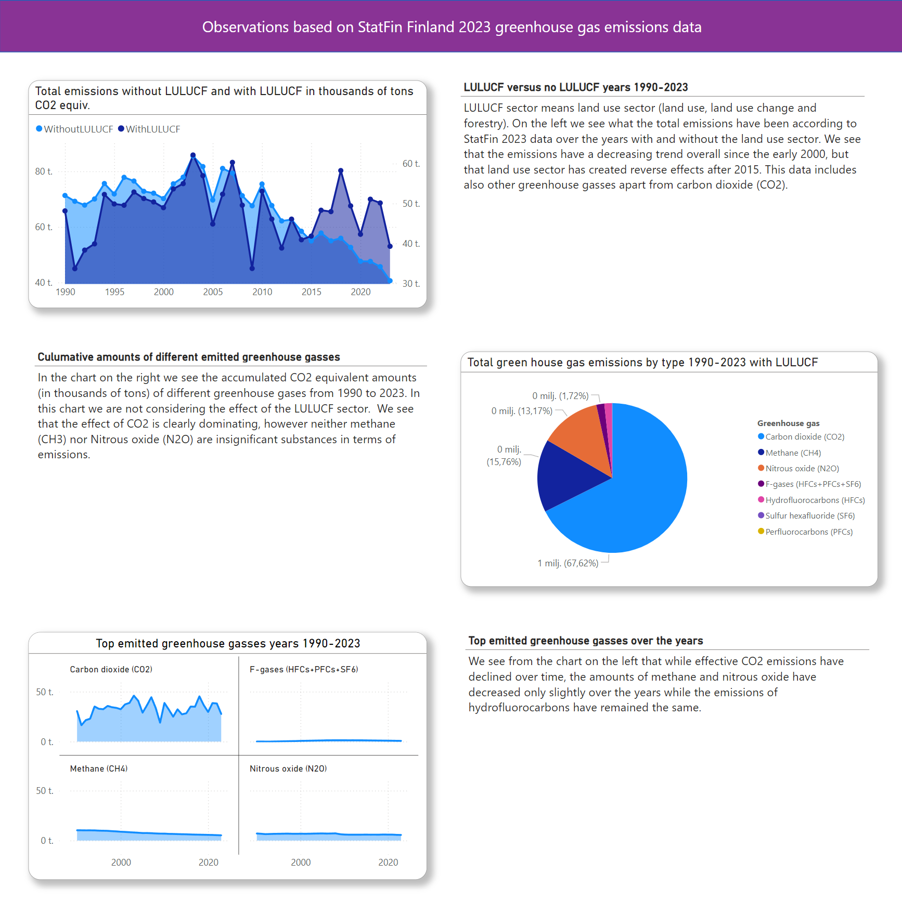
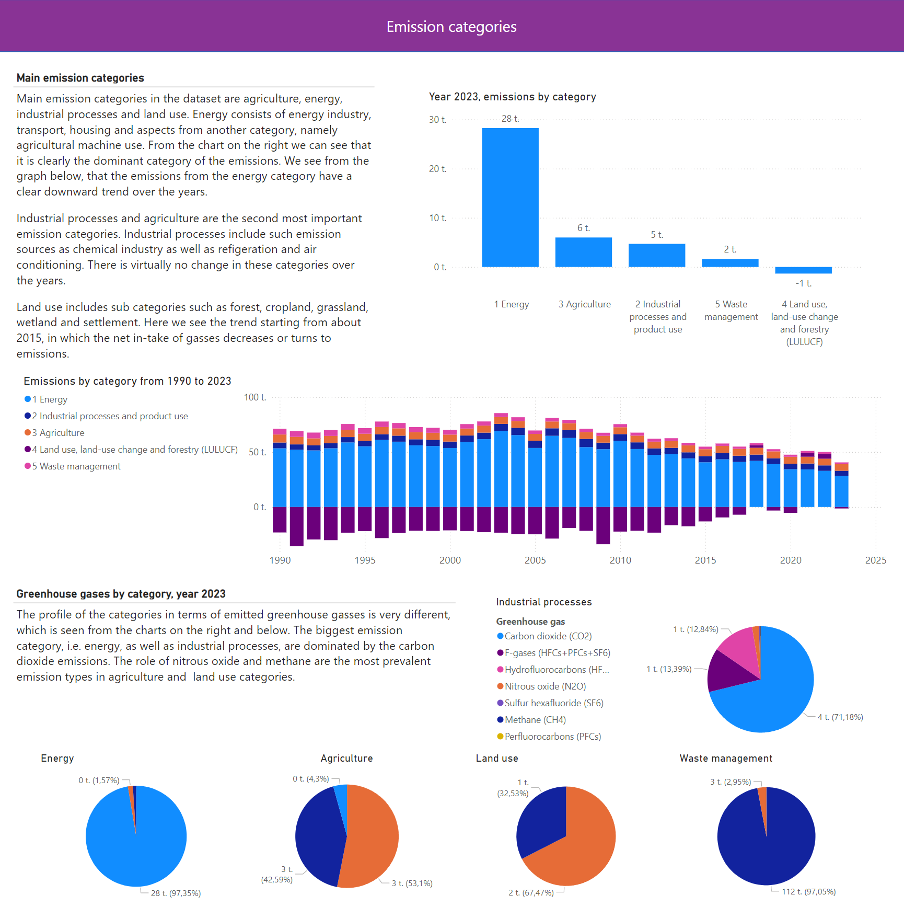
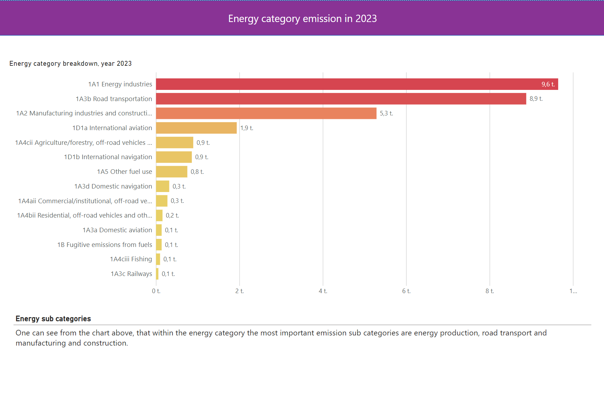

# Finland Greenhouse Gas Emissions 2023 visualization

FinlandEmissions2023 is a data visualization project, in which I investigate various aspects of the StatFin Finland 2023 greenhouse emissions data. The data covers years from 1990 to 2022 and preliminary data for the year 2023. It includes emissions from various sectors in a detailed way such as land use, energy and transport. Apart from the carbon dioxide (CO2) emissions, it includes emissions of other greenhouse gasses as well, such as methane. One can browse the data from https://stat.fi/tilasto/khki. For this project I wrote a simple python code to retrieve a chunk of the data from StatFin public API for further processing in Python and Power BI to create the visualizations.

This git project includes Power BI project files and Python code (data fetcher and a Jupyter notebook for data preparation) used to make the report shown in the screenshot in figures 1, 2 and 3.

 

<figure>
  
  <figcaption>Figure 1. Screenshot from the Power BI report</figcaption>
</figure>
 
 
<figure>
  
  <figcaption>Figure 2. Screenshot from the Power BI report</figcaption>
</figure>
 
<figure>
  
  <figcaption>Figure 3. Screenshot from the Power BI report</figcaption>
</figure>
 
 

# Status

The work so far has involved the following tasks:

- Finding out how to retrieve the data
- Examining what is in the data and finding interesting details in it
- Transforming the data to suit the Power BI visualization (cleaning rows with missing data etc.). Most of this was performed in Jupyter notebook, but some minor type changes etc were done in Power BI
- Writing Power BI measures using DAX filters to use specific data for specific visualizations
- Implementing visualizations, which tell some aspects of the data that I find interesting
- Writing clarifying texts highlighting my observations
- Stylizing the composed report

# Todo

I find the topic quite interesting and I intend to dig further in the data and to continue making additional visualizations. The data model in the Power BI could use some enhancements.
